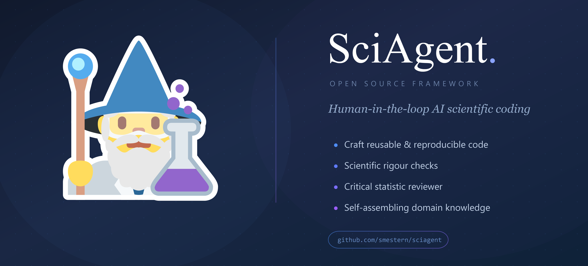
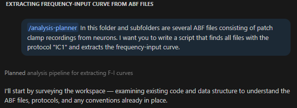
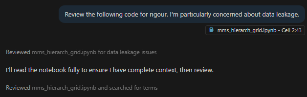
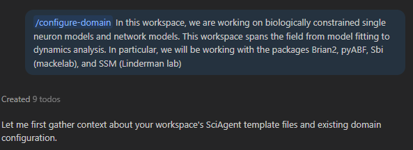
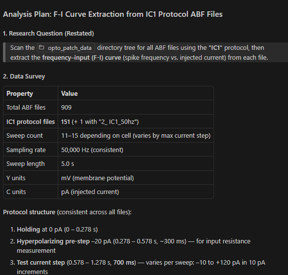
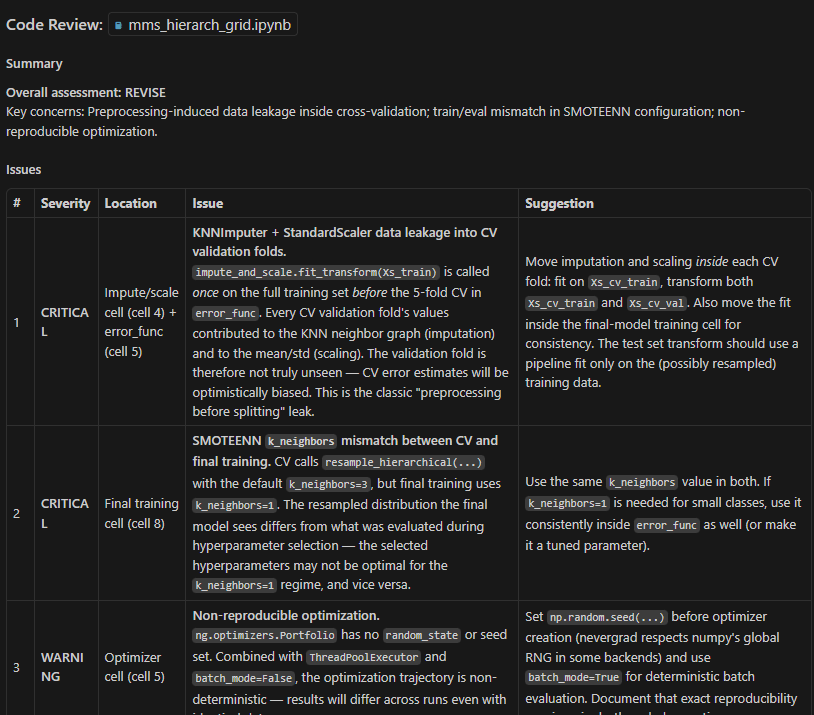
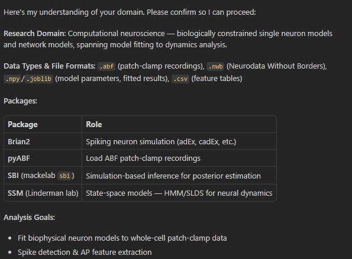

#  SciAgent

<p align="center">
     
</p>

**A generic framework for building AI-powered scientific data analysis agents.**

SciAgent provides the infrastructure so you can focus on your domain-specific tools and knowledge.

The idea here is to build more human-in-the-loop scientific coding tools. Landing somewhere in between the basic LLM chat interface, and the end-to-end AI for science tools. The goal of this project is not to do the science for you, but to help you write strong, rigorous, and reproducible research code. Essentially an LLM wrapper but with a few extra tools to make sure the LLM doesn't go off the rails.

**The core goal of this repo is to generate a domain-specific scientific agent in one of several output formats:**

1. **VS Code Copilot Plugin** (recommended) — a prebuilt plugin with 6 agents and 7 skills, ready to use in VS Code
2. **Copilot / Claude Code** — wizard-generated config files customized for your research domain
3. **Markdown** — platform-agnostic spec files you can paste into any LLM
4. **Fullstack** — a complete, runnable Python submodule with CLI and web UI

Check out [PatchAgent](https://github.com/smestern/patchAgent) for a real-world example in neurophysiology.

Built on the [GitHub Copilot SDK](https://github.com/features/copilot).  

---

## Guardrails

SciAgent enforces scientific rigor through a 5-layer system:

1. **System prompt principles** — embedded scientific best practices
2. **Tool priority hierarchy** — load real data before analysis
3. **Code scanner** — regex patterns block synthetic data generation, result fabrication
4. **Data validator** — checks for NaN, Inf, zero variance, suspicious smoothness
5. **Bounds checker** — domain-specific value range warnings

All layers are configurable and extensible. See [Architecture](docs/architecture.md) for the full pipeline diagram.

---

### See it in action

<!-- Each cell below is a placeholder — replace with real screenshots or transcript snippets -->

| `/analysis-planner` | `@sci-reviewer` (rigor review) | `/configure-domain` |
|:---------------------|:-------------------------------|:---------------------|
| **Plans before coding** — designs a step-by-step pipeline with success criteria and risk flags before a single line of code runs. | **Catches what linters can't** — flags missing uncertainty quantification, silent data exclusions, and unreproducible random seeds. | **Discovers your stack** — interviews you about your domain, finds relevant packages on PyPI, and generates skills + docs automatically. |
| |  |  |
|  |  |  |
| [Full example →](docs/examples/analysis-planner-example.md) | [Full example →](docs/examples/rigor-review-example.md) | [Full example →](docs/examples/configure-domain-example.md) |

> **More examples:** [docs/examples/](docs/examples/) — data QC, full wizard transcripts, and real-world walkthroughs.

**[Full plugin guide →](docs/getting-started-plugin.md)** · See also [`dist/sciagent/README.md`](dist/sciagent/README.md) for the bundled plugin reference.

---

## Quick Start — VS Code Plugin (recommended)

The fastest way to get SciAgent running. The prebuilt plugin ships **6 agents** and **7 skills** — no Python install required.

> **Where is the plugin?**
> - **GitHub releases / CI** → [`dist/sciagent/`](dist/sciagent/) (built by GitHub Actions)
> - **Local build** → `build/plugin/sciagent/` (run `python scripts/build_plugin.py`)

**1. Clone or download this repo**

```bash
git clone https://github.com/smestern/sciagent.git
```

**2. Add the plugin to VS Code**

Open VS Code Settings (JSON) and add:

```jsonc
// settings.json
"chat.plugins.paths": {
    // Use the dist/ path from a release, or build/plugin/ for local builds
    "/path/to/sciagent/dist/sciagent/.github/plugin": true
}
```

**3. Restart VS Code**

Open Copilot Chat and type `@sci-coordinator` — all 6 agents and 7 skills are available immediately.

### What you get

| Agent | Role |
|-------|------|
| `@sci-coordinator` | Routes tasks to the right specialist |
| `@sci-coder` | Writes analysis code with scientific rigor |
| `@sci-reviewer` | Audits code and results for correctness and reproducibility |
| `@sci-report-writer` | Generates publication-quality reports |
| `@sci-docs-ingestor` | Ingests Python library documentation |
| `@sci-domain-assembler` | Configures SciAgent for your research domain |

| Skill | Purpose |
|-------|---------|
| `/analysis-planner` | Design step-by-step analysis pipelines |
| `/configure-domain` | First-time domain setup (interview + package discovery) |
| `/data-qc` | Systematic data quality control checks |
| `/docs-ingestor` | Learn an unfamiliar Python library |
| `/report-writer` | Generate structured scientific reports |
| `/review` | Code + scientific rigor audit |
| `/scientific-rigor` | Auto-enforced rigor principles (always active) |

**Typical workflow:**

```
You: @sci-coordinator I have calcium imaging data in traces.csv.
     Find responsive neurons and characterize their response profiles.

Coordinator → Data QC → Coder → Rigor Reviewer → Report Writer
```


## Quick Start — Custom Domain Agent (wizard)

Want agents tailored to your specific research domain? The wizard interviews you, discovers relevant Python packages, and generates a ready-to-use agent project.

```bash
pip install "sciagent[all] @ git+https://github.com/smestern/sciagent.git"
pip install "sciagent-wizard @ git+https://github.com/smestern/sciagent-wizard.git"
sciagent wizard -m copilot_agent     # generates VS Code + Claude Code agent files
```

Copy the generated `.github/agents/` and `.claude/agents/` folders into your project — VS Code picks them up automatically.

**[Full setup guide →](docs/getting-started-copilot.md)**

---

## Installation

```bash
# Neither package is on PyPI yet — install from GitHub
pip install "sciagent @ git+https://github.com/smestern/sciagent.git"            # core framework only
pip install "sciagent[cli] @ git+https://github.com/smestern/sciagent.git"       # + terminal REPL (Rich, Typer)
pip install "sciagent[web] @ git+https://github.com/smestern/sciagent.git"       # + browser chat UI (Quart)
pip install "sciagent[all] @ git+https://github.com/smestern/sciagent.git"       # core + CLI + web

# Self-assembly wizard (separate package)
pip install "sciagent-wizard @ git+https://github.com/smestern/sciagent-wizard.git"
```

The wizard is a **separate package** (`sciagent-wizard`) that registers itself as a plugin via the `sciagent.plugins` entry-point group. Installing it automatically adds the `sciagent wizard` CLI command, web blueprints (`/wizard/`, `/public/`, `/ingestor/`), and the `ingest_library_docs` tool — no configuration needed.

See [Installation](docs/installation.md) for prerequisites, dev setup, and verification steps.

---

## Output Formats

SciAgent generates a domain-specific scientific agent in several formats. Pick the one that fits your workflow:

### 1. Copilot / Claude Code — IDE config files (recommended)

Markdown-based agent definitions that plug directly into VS Code Copilot Chat or Claude Code. Start with the **prebuilt plugin** above for zero-config, or generate domain-customized agents via the wizard.

```bash
sciagent wizard -m copilot_agent
```

**[Full setup guide →](docs/getting-started-copilot.md)** · **[Agents & Skills Reference →](docs/copilot-agents.md)**

### 2. Markdown — platform-agnostic spec files

A self-contained set of Markdown files defining persona, tools, data handling, guardrails, and workflow. Paste into any LLM — ChatGPT, Gemini, Claude, local models, etc.

```bash
sciagent wizard -m markdown
```

**[Full setup guide →](docs/getting-started-markdown.md)**

### 3. Fullstack — Python agent with CLI & web UI

A complete, runnable Python submodule you can install and launch immediately. Includes sandboxed code execution, guardrails, Rich terminal REPL, and browser-based chat UI.

```bash
sciagent wizard -m fullstack
```

**[Full setup guide →](docs/getting-started-fullstack.md)**


---

## How to Use This Repo

| Path | Best for | What you do |
|------|----------|-------------|
| **A. Prebuilt Plugin** | Quick start, no Python needed | Clone → add plugin path to VS Code settings → go |
| **B. Self-Assembly Wizard** | Custom domain agents | `pip install sciagent[all]` + `sciagent-wizard` → run wizard → copy output into workspace |
| **C. Markdown Templates** | Any LLM (ChatGPT, Gemini, etc.) | Download [`templates/`](templates/) → edit → paste into your LLM |
| **D. Fullstack Agent** | Python SDK with CLI & web UI | `pip install sciagent[all]` → subclass `BaseScientificAgent` → build custom tools |

### More detail

1. **Prebuilt plugin (Path A)** — The fastest path. The plugin in `dist/sciagent/` (or `build/plugin/sciagent/` for local builds) ships 6 agents and 7 skills, ready to use. See [Plugin Guide](docs/getting-started-plugin.md).

2. **Self-assembly wizard (Path B)** — Describe your research domain to the wizard and it discovers relevant packages, fetches their documentation, and generates a ready-to-use agent project in your chosen format. The wizard lives in its own package ([sciagent-wizard](https://github.com/smestern/sciagent-wizard)) so framework users aren't affected by wizard-only releases. See [Wizard Guide](docs/getting-started-copilot.md).

3. **Markdown templates (Path C)** — At its core, this repo contains Markdown templates to assist with building your agent. Download and customize [templates/](templates/) for your domain. See [Markdown Guide](docs/getting-started-markdown.md).

4. **Fullstack agent (Path D)** — A full agent framework built on the [Copilot SDK](https://github.com/github/copilot-sdk) with sandboxed code execution, domain tools, and the ability to ingest new package docs. See [Fullstack Guide](docs/getting-started-fullstack.md).

Ideally, I was hoping to host a public version of the wizard for open use — however, I can't afford the hosting / LLM API fees as a grad student. If you are a company willing to help out, please contact me.

## See Also

You may be interested in [DAAF](https://github.com/DAAF-Contribution-Community/daaf), the Data Analyst Augmentation Framework, by Brian Heseung Kim! A framework with much of the same goals and ideas, better oriented for Claude Code. Claude Code support here is minimal as I use VS Code as my daily driver.

---

## Documentation

| # | Page | Description |
|---|------|-------------|
| 0 | **README** | This document — overview, quick start, and links |
| 1 | [Getting Started: Plugin](docs/getting-started-plugin.md) | Install the prebuilt VS Code plugin (no Python needed) |
| 2 | [Getting Started: Wizard](docs/getting-started-copilot.md) | Generate custom domain agents via the self-assembly wizard |
| 3 | [Getting Started: Markdown](docs/getting-started-markdown.md) | Platform-agnostic spec files for any LLM |
| 4 | [Getting Started: Fullstack](docs/getting-started-fullstack.md) | Build a runnable Python agent with CLI & web UI |
| 5 | [Copilot Agents & Skills Reference](docs/copilot-agents.md) | Agent/skill file formats, roster, handoff workflow |
| 6 | [Installation](docs/installation.md) | Prerequisites, install variants, CLI commands, dev setup |
| 7 | [API / Programmatic Usage](docs/api-usage.md) | `AgentConfig`, `BaseScientificAgent`, tools, guardrails API |
| 8 | [Architecture](docs/architecture.md) | System diagram, module reference, guardrails pipeline |
| 9 | [Domain Examples](docs/domains/) | Pre-configured domain setups (intracellular-ephys, extracellular-ephys) |
| 10 | [Feature Examples](docs/examples/) | Annotated transcripts — analysis planner, rigor review, configure domain, data QC |
| 11 | [Showcase: PatchAgent](docs/showcase.md) | Real-world walkthrough in neurophysiology |

---

## Plugin Architecture

SciAgent uses a plugin system based on [setuptools entry points](https://packaging.python.org/en/latest/specifications/entry-points/). Any installed package can extend the framework by registering under the `sciagent.plugins` group:

```toml
# In your package's pyproject.toml
[project.entry-points."sciagent.plugins"]
my-plugin = "my_package:register_plugin"
```

The `register_plugin()` callable returns a `PluginRegistration` declaring:

| Field | Type | Purpose |
|-------|------|---------|
| `register_web` | `(app, **ctx) → None` | Register Quart blueprints and auth middleware |
| `register_cli` | `(app) → None` | Add Typer sub-commands |
| `get_auth_token` | `() → str | None` | Provide auth tokens (e.g. OAuth) |
| `supported_models` | `dict` | Declare LLM models for routing/billing |
| `tool_providers` | `dict[str, callable]` | Lazy-load tool functions |

The wizard (`sciagent-wizard`) is the first plugin built on this system. See [`src/sciagent/plugins.py`](src/sciagent/plugins.py) for the full API.

---

## Links

- [sciagent-wizard](https://github.com/smestern/sciagent-wizard) — self-assembly wizard for building domain agents (plugin)
- [PatchAgent](https://github.com/smestern/patchAgent) — a full SciAgent implementation for electrophysiology (see [Showcase](docs/showcase.md))
- [Templates README](templates/README.md) — blank templates for manual agent specification
- [Domain Examples](docs/domains/) — pre-configured domain setups with skills and docs

---

<details>
<summary><strong>Authentication (Optional)</strong></summary>

The public wizard (`/public`) and docs ingestor (`/ingestor`) support **opt-in GitHub OAuth** via the [Copilot SDK auth flow](https://github.com/github/copilot-sdk/blob/main/docs/auth/index.md#github-signed-in-user). When enabled, users sign in with GitHub and their OAuth token is passed through to the Copilot SDK, billing LLM usage to their own Copilot subscription.

**When OAuth env vars are not set, the app behaves exactly as before — fully open, no auth.**

### Setup

1. [Create a GitHub OAuth App](https://docs.github.com/en/developers/apps/building-oauth-apps/creating-an-oauth-app):
   - **Homepage URL:** `https://your-domain.com`
   - **Authorization callback URL:** `https://your-domain.com/auth/callback`

2. Set environment variables:

   | Variable | Required | Description |
   |----------|----------|-------------|
   | `GITHUB_OAUTH_CLIENT_ID` | Yes | OAuth App client ID |
   | `GITHUB_OAUTH_CLIENT_SECRET` | Yes | OAuth App client secret |
   | `SCIAGENT_SESSION_SECRET` | Recommended | Session cookie signing key (random string) |
   | `SCIAGENT_SESSION_SECURE` | No | Set to `1` for HTTPS-only session cookies |
   | `SCIAGENT_ALLOWED_ORIGINS` | No | Restrict CORS origins (default: `*`) |

3. Run: `sciagent-public` (wizard) or `sciagent-docs` (ingestor)

### How it works

- `/auth/login` → GitHub OAuth authorize → `/auth/callback` exchanges code for token → stored in HttpOnly session cookie
- Protected routes redirect unauthenticated users to `/auth/login`
- Token threaded through to `CopilotClient({"github_token": ...})`

### Security

- Session cookies: `HttpOnly`, `SameSite=Lax`
- CSRF protection via `secrets.token_urlsafe(32)` state parameter
- Only `gho_*`, `ghu_*`, `github_pat_*` tokens accepted (classic `ghp_*` PATs rejected)
- When OAuth is disabled: **zero auth code runs** — no middleware, no redirects, no cookies

</details>

---

## License

MIT
